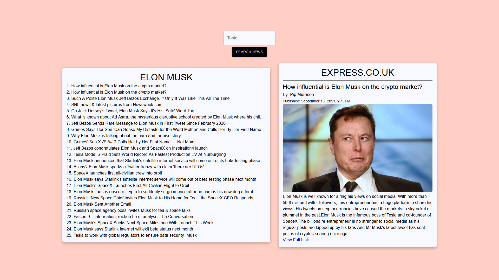
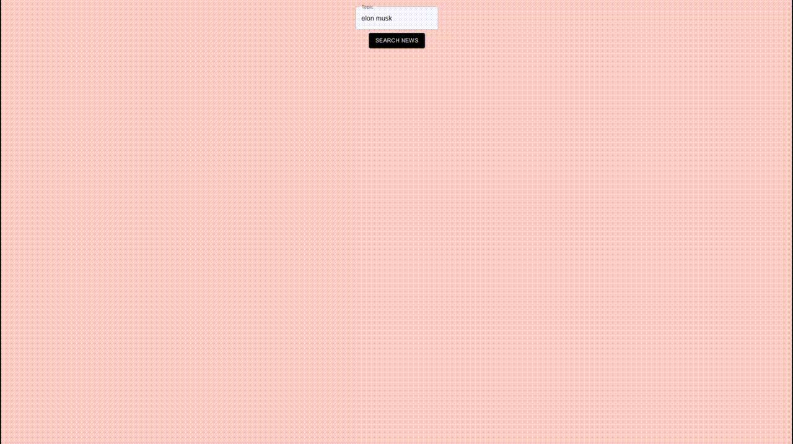
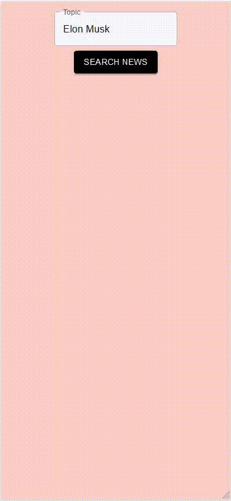

# News App in React

By: Justin Mabutas



## Description

Front-end news application that fetches data from [Free News API](https://free-docs.newscatcherapi.com/#introduction) and displays it on a modern and responsive web application.

## Demos




## Installation

Clone the git repository to your machine.

Use node package manager [npm](https://www.npmjs.com/) to install dependencies.

```bash
npm install
```

Create a .env file at the root directory of the project with your RapidAPI FreeNews API key and host.

```bash
REACT_APP_API_HOST={insert your api host here}
REACT_APP_API_KEY={insert your api key here}
```

Now run.

```bash
npm start
```
